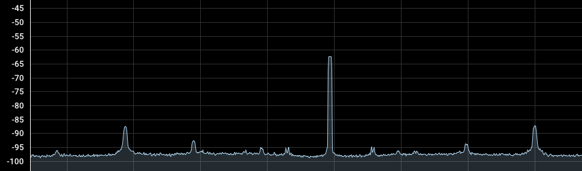
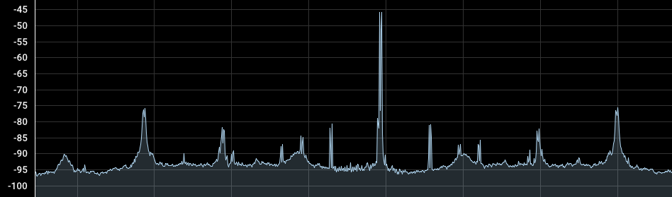
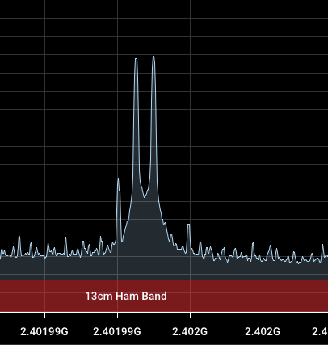
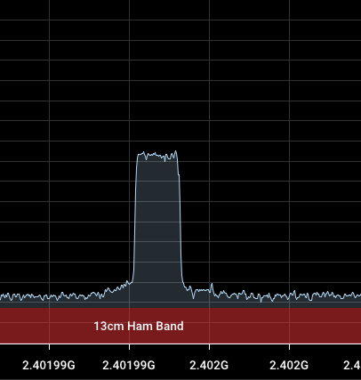
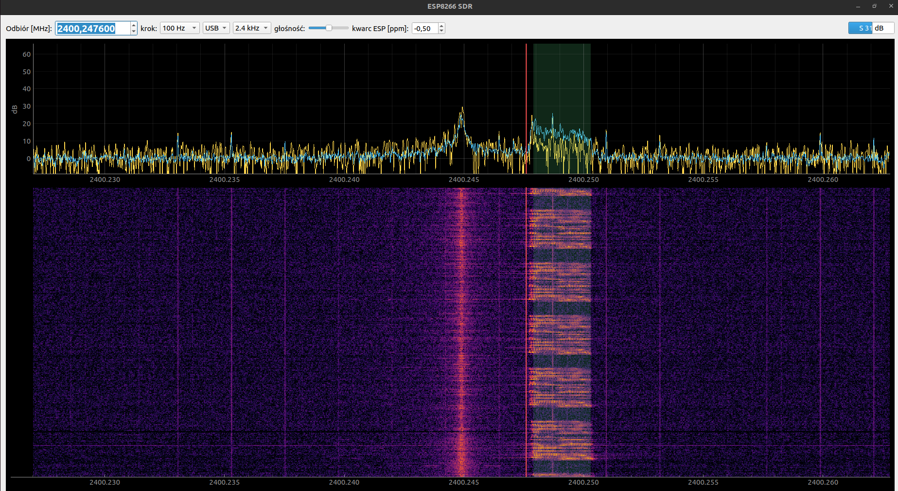

# ESP8266 SSB transceiver on 2.4 GHz

A bare ESP8266 transmits SSB voice (USB/LSB) on 2.4 GHz with no extra RF
hardware. It drives the PHY's internal test-tone generator directly through
registers. The PC computes SSB samples and streams them over USB, and the
ESP modulates them. Any SDR in USB mode can receive it (tested with a
HackRF One and SDR++).

**This is a real transmitter.** Operate only where you are allowed to
(an amateur licence in the 13 cm band, or within ISM/SRD rules). Long
continuous TX makes the chip hot, and Wi-Fi is unavailable while
transmitting.

## Files

| File | Purpose |
|---|---|
| `CW_CARRIER_TEST/CW_CARRIER_TEST.ino` | firmware: modulator, `STREAM` mode, SSB from flash, CW/FM/AM |
| `CW_CARRIER_TEST/ssb_data.h`, `audio_data.h` | test recording in flash (SSB 32 kS/s, FM/AM 8 kS/s) |
| `CW_CARRIER_TEST/audio/stream_ssb.py` | live SSB: audio files from the PC over USB |
| `CW_CARRIER_TEST/audio/ssb_dsp.py` | DSP: speech processor, analytic signal, envelope/frequency split |
| `CW_CARRIER_TEST/audio/make_audio_h.py` | builds `ssb_data.h` / `audio_data.h` from an audio file |
| `CW_CARRIER_TEST/audio/sp8esa.mp3` | test recording |
| `CW_CARRIER_TEST/audio/esp_sdr.py` | receiver: spectrum, waterfall and USB/LSB demodulator using the ESP as an IQ receiver |
| `CW_CARRIER_TEST/audio/rx_iq.py` | receiver: raw IQ capture from the ESP to WAV / cs16 |
| `CW_CARRIER_TEST/audio/hackrf_ssb_tx.py` | SSB test signal from a HackRF, looped (for testing the receiver) |
| `ODBIORNIK_IQ.md` | receiver notes in Polish: registers, ROM/libphy functions, measurements |

## Requirements

- ESP8266 board with 4 MB flash. Tested on a Wemos D1 mini style board;
  its USB-UART bridge (CH340 here) must handle 2 Mbaud.
- `arduino-cli` or Arduino IDE with the `esp8266:esp8266` 3.1.2 core.
- Python 3 with numpy, scipy and pyserial (`pip install -r requirements.txt`),
  and `ffmpeg` in `PATH`.

## Usage

Flash the firmware at 160 MHz. The modulator counts CPU cycles, so it has
only been tested at that clock:

```sh
FQBN=esp8266:esp8266:d1_mini:xtal=160,eesz=4M
arduino-cli compile --fqbn $FQBN CW_CARRIER_TEST
arduino-cli upload  --fqbn $FQBN -p /dev/ttyUSB0 CW_CARRIER_TEST
```

After power-up the ESP stays silent and waits for commands on the serial
port (115200 baud, `?` lists them).

**Live from the PC:**

```sh
cd CW_CARRIER_TEST/audio
python3 stream_ssb.py sp8esa.mp3 --freq 2402
```

The script resets the ESP, switches it to `STREAM` at 2 Mbaud and loops
the files with a 1 s gap until Ctrl-C.

| Option | Meaning |
|---|---|
| `--freq` | carrier in MHz, 1 kHz resolution |
| `--lsb` | lower sideband instead of upper |
| `--comp` | speech processor strength (`light` (default), `soft`, `mid`, `hard`) |
| `--raw` | band-pass filter only, no speech processor |
| `--gap` | pause between files in seconds (`0` = seamless loop) |
| `--gate` | ms below the ASK floor before the tone is gated off (`0` = never) |
| `--seconds` | stop after N seconds |
| `--port` | serial port |

Apart from audio files, the script also accepts test sources. These skip
the speech processor; use them with `--gap 0` for continuous TX:

| Source | Signal |
|---|---|
| `twotone[:F1:F2]` | two equal tones, 700 + 1900 Hz by default, peak envelope at full power (IMD test) |
| `noise[:S]` | white noise in 200–2800 Hz, S-second loop (spurious emission test) |
| `sine:F[:S]` | single tone |
| `cw:F[:S]` | fixed frequency, constant envelope |
| `silence:S` | gate off |

```sh
python3 stream_ssb.py twotone --gap 0 --freq 2402
```

**From flash, no PC needed:** send `USB 2402` or `LSB 2402` on the serial
port, and `OFF` to stop. To put in your own recording, run
`python3 make_audio_h.py file.wav` and recompile. Each second of SSB takes
about 125 KB of flash.

Tune the receiver by ear. The crystals of the ESP and the SDR differ by a
few ppm, which is a few kHz at 2.4 GHz.

## How it works

- **Radio:**
  - The test-tone slot (`0x600005B8`) has three fields: K, a signed offset
    from the Wi-Fi channel centre (78.125 kHz per code); a digital
    attenuator (ASK, about 0.24 dB per step); and an on/off gate.
  - The firmware tunes the PLL to the nearest channel once, then modulates
    only by writing that register. The PLL is never retuned and there are
    no gaps.
- **SSB by the polar method (Kahn, EER):**
  - The PC turns speech into an analytic signal a(t)·e^{jφ(t)}.
  - The envelope a(t) drives ASK, and the instantaneous frequency dφ/dt
    drives K. LSB is the same with the frequency negated.
  - Samples run at 32 kS/s.
- **Fractional K:** `ditherBurst()` keeps the nearest code in the register
  and integrates the phase error every CPU cycle. When the error passes
  about 3.5°, it writes k±1 for exactly the number of cycles that cancels
  it. Fractional amplitude is dithered between ASK n and n+1. Streaming
  runs with interrupts disabled, because any stall shows up as a phase
  step.
- **Envelope range:** ASK spans about 31 dB. Below that floor the envelope
  is clipped, and after 5 ms below it the gate switches the tone off. The
  floor is never dithered with the gate, because every gate turn-on starts
  the tone with a random phase. There is no predistortion: a measured
  AM-AM/AM-PM/AM-FM correction made the two-tone test worse, so the DSP
  uses the nominal 0.24 dB/step law.
- **DSP on the PC:** 200–2800 Hz band-pass, auto-EQ, compressor,
  look-ahead limiter and envelope compression, then `polar()` with
  error-feedback quantisation, so the phase does not drift.
- **USB protocol:** 2 Mbaud. Each packet is `A5 5A`, then 64 × (envelope
  u8, frequency i16 LE in Q16 K units), then an XOR checksum. The ESP
  buffers 4096 samples (128 ms) and reports its fill level back so the
  PC can pace the stream.

## Receiver (experimental)

The ESP8266 also works as a narrowband IQ receiver. The hardware DC/IQ
estimator of the Wi-Fi receiver (normally used for calibration) averages
2^k ADC samples (40 MS/s); repeating it gives complex samples at about
35.7 kS/s (k=10), streamed over USB at 2 Mbaud (`IQSTREAM f k mode`). The
LO can be set anywhere from 2300 to 2600 MHz in 1/1024 MHz steps: nearest
Wi-Fi channel plus a fractional-N PLL offset (`set_rf_freq_offset` from
`libphy.a`). `esp_sdr.py` shows the spectrum and waterfall and demodulates
USB/LSB with sound; click the spectrum to tune. It needs PyQt5, pyqtgraph
and sounddevice in addition to the requirements above. Details and
measurements (in Polish): `ODBIORNIK_IQ.md`.

```sh
cd CW_CARRIER_TEST/audio
python3 hackrf_ssb_tx.py &       # optional test signal: USB on 2400.250 MHz
python3 esp_sdr.py --f 2400.250
```

## Screenshots

ESP8266 transmitter, `STREAM` mode, USB on 2402.000 MHz, received with a
HackRF One in SDR++ (test sources from `stream_ssb.py`, no speech
processor). Polish captions: `zrzuty/OPIS.md`.

| | |
|---|---|
|  |  |
| White noise in the SSB band (200–2800 Hz), wide view. Symmetric lines from CH340 UART traffic at ±153 kHz (weaker at ±51 and ±306 kHz). | Two-tone test (700 + 1900 Hz), same view. |
|  |  |
| Two-tone close-up above the suppressed carrier. The weak line about 0.5 kHz below the carrier is most likely third-order IMD (2·f1 − f2). | White noise close-up: transmit passband shape and out-of-band level. |

ESP8266 receiver (`esp_sdr.py`) demodulating `sp8esa.mp3` sent by a HackRF
in USB on 2400.250 MHz. The red line is the receive frequency, the green
area the 2.4 kHz USB filter; the line at 2400.245 MHz is the ESP LO (DC
residue).



## Limitations

- In `STREAM` mode the USB-UART traffic adds sidebands at ±153 kHz, about
  −19 dB relative to the signal (weaker ones at ±51 and ±306 kHz).
  Playback from flash does not have them.
- Sample images appear at ±32 kHz.

## Credits

The PHY control code is based on
[kaboom748/esp8266_WLAN_PHY](https://github.com/kaboom748/esp8266_WLAN_PHY)
(MIT, © 2026 kaboom748). It provides the tone slot, PBUS and RX-stop
registers, the ROM functions `set_txclk_en` and `set_ana_inf_tx_scale`,
the TX path on/off sequence, and the K and ASK step sizes.

The polar method follows L. R. Kahn, "Single-Sideband Transmission by
Envelope Elimination and Restoration", Proc. IRE 40(7), 1952.

## License

MIT, see [LICENSE](LICENSE).
